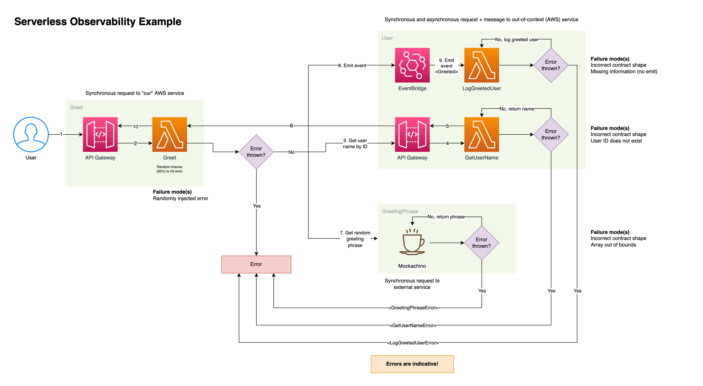

# Serverless Observability example: AWS + Honeycomb or Datadog

**This repo presents a complete project to demonstrate a "broken" observable serverless application.**

This project is built using Typescript and runs on API Gateway and Lambda. It is composed of two separate backend services ("internal") and one mock server on Mockachino ("external") that serves a subset of the content.

Additionally, there is a set of AWS CloudWatch alerts included to demonstrate such usage.

## Diagram

The below diagram gives an indicative sense of the overall flow.

## Prerequisites

It is assumed that:

- You have a recent [Node.js](https://nodejs.org/en/) version installed (ideally version 18 or later)
- You have an [AWS](https://aws.amazon.com/account/sign-up) account
- You have sufficient privileges to deploy infrastructure such as Lambda, API Gateway and S3 to AWS
- You are logged into AWS through your environment

## Deployment

_Version 2.0 introduced support for Datadog in addition to the existing Honeycomb support. It won't quite be as a rich an experience as using Honeycomb but it will definitely be servicable._

The instructions below relate broadly to either tool. When it comes to getting API keys and such, please refer to [Datadog's own instructions](https://docs.datadoghq.com/account_management/api-app-keys/).

Make sure to check the respective `serverless.yml` files for the services and remove anything you don't want to use.

### 1. Get a free Honeycomb account and API key

Go to [Honeycomb](https://www.honeycomb.io) and get a free, generous account.

Create an API key for a new environment. **Note the environment name and key for later**.

For more information, refer to [https://docs.honeycomb.io/getting-data-in/api-keys/](https://docs.honeycomb.io/getting-data-in/api-keys/).

### 2. Set up `GreetingPhrase`

Open up `code/GreetingPhrase` and follow the instructions there on how to put up a new Mockachino endpoint with the JSON contents in the folder.

**Save the endpoint URL for the third step**.

### 3. Deploy `User` service

Go to `code/User` and update the following values in `serverless.yml` with those you got from Honeycomb:

- `LIBHONEY_DATASET`: Name of your dataset
- `LIBHONEY_API_KEY`: The actual API key

Next, run `npm install` (or `yarn install`) and deploy with `npm run deploy` (or `yarn run deploy`).

**Save the endpoint URL for the third step**.

### 4. Deploy `Greet` service

Go to `code/User` and update the following values in `serverless.yml` with those you got from Honeycomb:

- `LIBHONEY_DATASET`: Name of your dataset
- `LIBHONEY_API_KEY`: The actual API key

Also edit the following fields to the values you've saved from before:

- `GREETING_PHRASES_SERVICE_URL` to the Mockachino endpoint URL
- `GET_USER_NAME_SERVICE_URL` to the `User` service endpoint URL on AWS
- Set `custom.aws.awsAccountNumber` to your AWS account number
- Optionally: Set `custom.aws.eventBusName` to the event bus name you have changed it (default: `observabilitydemo`)

Install the dependencies with `npm install` or `yarn install`, then deploy the service with `npm run deploy` (or `yarn run deploy`).

### 5. Run a bit of test traffic to create logs and traces

You can either do a crude manual call like `curl -X POST -d '{"id":1}' https://RANDOM.execute-api.REGION.amazonaws.com/greet` or use [k6](https://k6.io/).

To use `k6` you will first need to install it. Go to the `load` folder and run `npm run install:k6` which will use [homebrew](https://brew.sh) to install `k6`.

Then, you will need to modify the load testing script (`test.js`), ensuring the endpoint is updated to your own `greet` endpoint. Now you should be able to run it with `npm test`. Feel free to modify the settings as you please.

### 6. Check and observe!

Honeycomb will get logs streamed continuously from AWS. You should be able to see logs both in AWS CloudWatch as well as in Honeycomb now.
